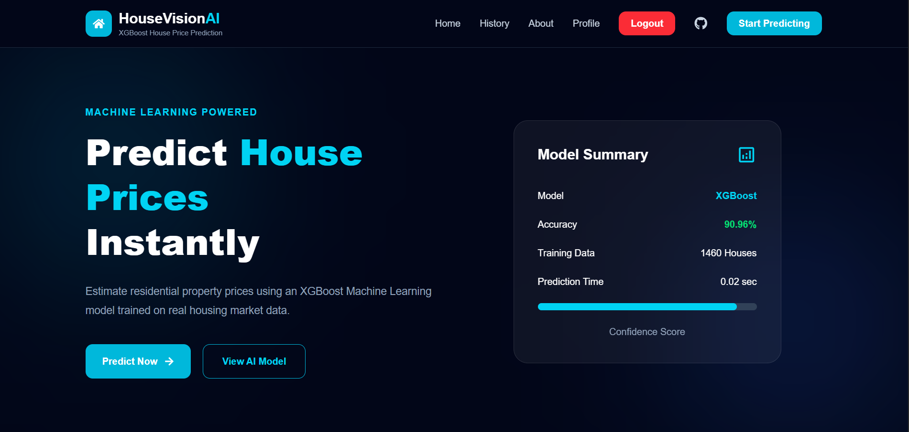
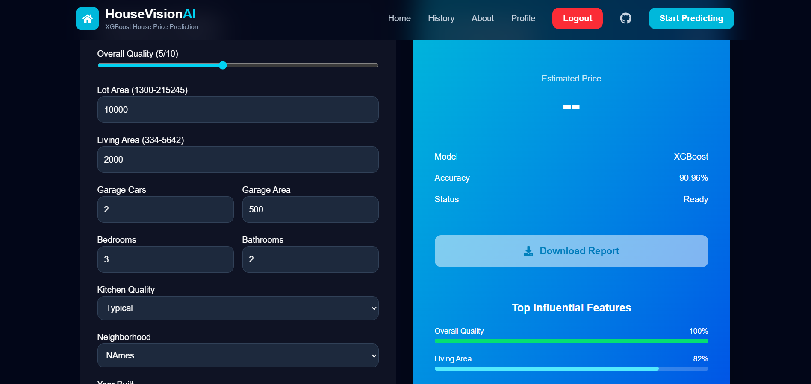
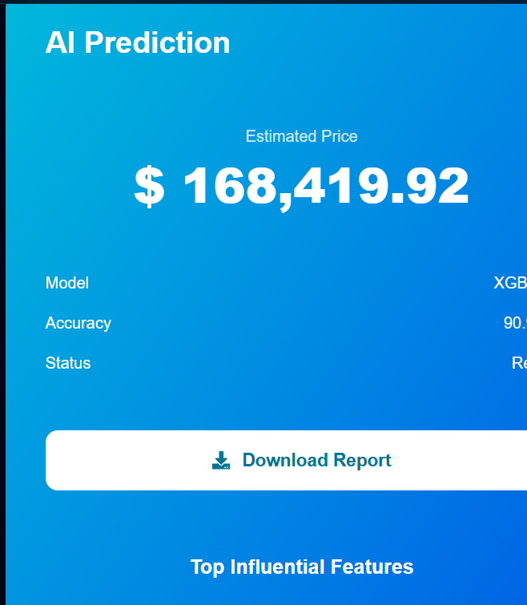
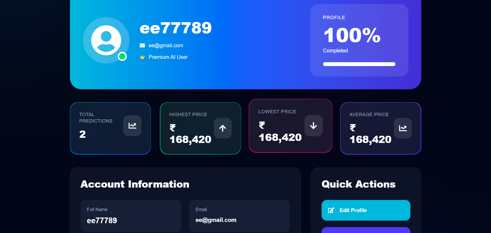
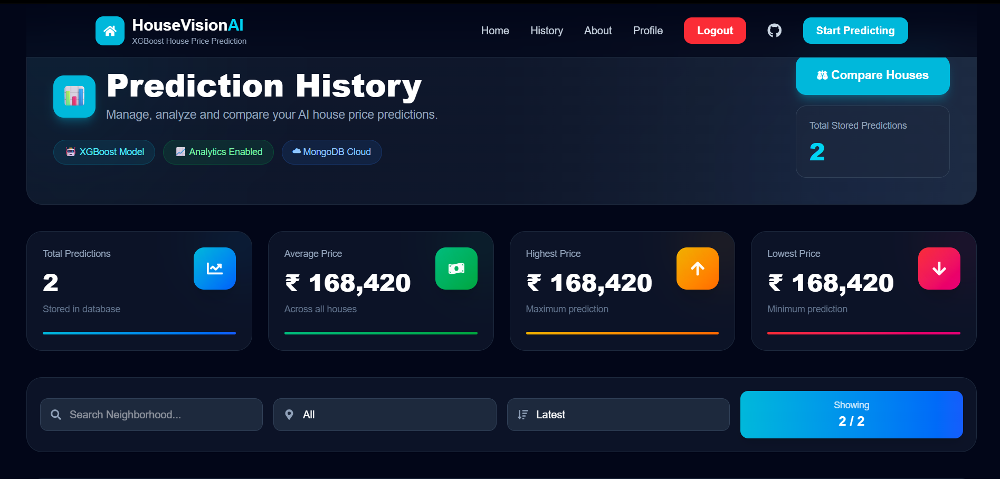
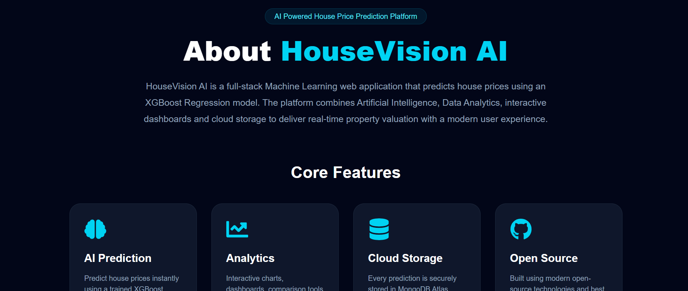
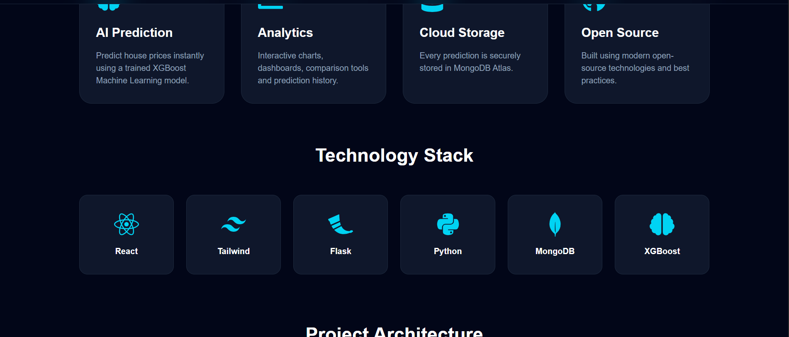
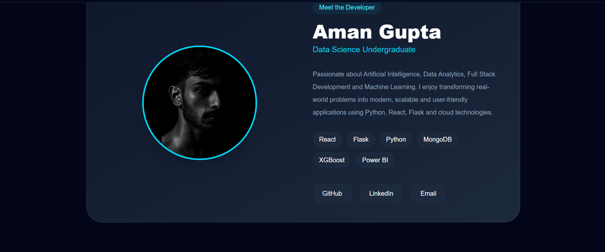

# 🏡 HouseVision AI

<div align="center">

### 🤖 AI-Powered House Price Prediction System

Predict house prices instantly using Machine Learning with a modern full-stack web application built using **React, Flask, MongoDB, and XGBoost**.


⭐ If you like this project, don't forget to star the repository!

</div>

---

# 📖 Overview

HouseVision AI is a full-stack AI-powered web application that predicts house prices using a trained XGBoost Machine Learning model.

The application allows users to securely register, log in, predict house prices, view prediction history, manage their profile, and interact with an elegant modern interface.

---

# ✨ Features

## 🔐 Authentication

- User Registration
- Secure Login
- JWT Authentication
- Logout

---

## 👤 User Profile

- View Profile
- Edit Profile
- Change Password
- Responsive Dashboard

---

## 🤖 AI Prediction

- House Price Prediction
- Instant Results
- Machine Learning Powered
- AI Model Information

---

## 📊 Prediction History

- Save Predictions
- View Previous Predictions
- Organized History Dashboard

---

## 🎨 Modern UI

- Responsive Design
- Tailwind CSS
- Framer Motion Animations
- Smooth Scrolling
- Toast Notifications
- Beautiful Cards & Dashboard

---

# 🛠 Tech Stack

## Frontend

- React.js
- Vite
- Tailwind CSS
- React Router DOM
- Axios
- Framer Motion
- React Icons
- React Hot Toast
- Lenis

---

## Backend

- Flask
- Flask JWT Extended
- Flask Bcrypt
- Flask CORS
- PyMongo
- MongoDB Atlas

---

## Machine Learning

- Python
- Pandas
- NumPy
- Scikit-learn
- XGBoost
- Joblib

---

# 📂 Folder Structure

```text
HouseVision-AI
│
├── frontend/
│   ├── src/
│   ├── public/
│   ├── package.json
│   └── README.md
│
├── backend/
│   ├── app.py
│   ├── model.pkl
│   ├── requirements.txt
│   ├── routes/
│   ├── models/
│   └── README.md
│
└── README.md
```

---

# 📷 Screenshots

## 🏠 Home Page


---

## 🤖 Prediction Page

>

---

## 📈 Prediction Result



---

## 👤 Profile Dashboard



---

## 📜 Prediction History


---

## ℹ️ About Page





---

# ⚙️ Installation

## Clone Repository

```bash
git clone https://github.com/yourusername/HouseVision-AI.git
```

```bash
cd HouseVision-AI
```

---

# Frontend

```bash
cd frontend

npm install

npm run dev
```

Runs on:

```
http://localhost:5173
```

---

# Backend

```bash
cd backend

python -m venv venv
```

Windows

```bash
venv\Scripts\activate
```

Linux / macOS

```bash
source venv/bin/activate
```

Install dependencies

```bash
pip install -r requirements.txt
```

Run

```bash
python app.py
```

Backend:

```
http://localhost:5000
```

---

# 🔮 Future Improvements

- Email Verification
- Forgot Password
- Dashboard Analytics
- Charts & Reports
- Prediction Comparison
- Export Prediction as PDF
- Profile Picture Upload
- Admin Dashboard
- Dark/Light Mode

---

# 👨‍💻 Developer

## Aman Gupta

B.Tech Data Science Student

JSS Academy of Technical Education, Noida

📧 Email: **amanguptanew0612005@gmail.com**

---

# 🤝 Contributing

Contributions, issues, and feature requests are welcome.

Feel free to fork the repository and submit a Pull Request.

---

# 📜 License

This project is intended for educational and portfolio purposes.

---

<div align="center">

### ⭐ Thank you for visiting this repository!

Made with ❤️ by **Aman Gupta**

</div>